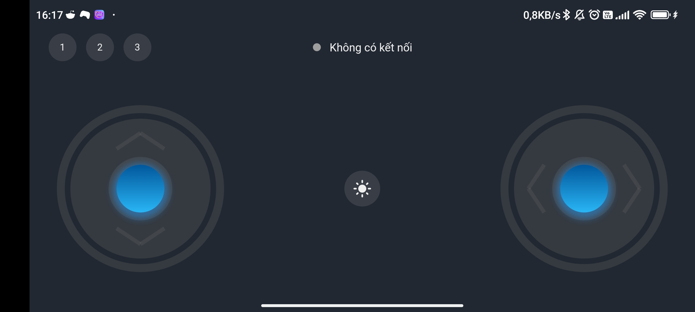
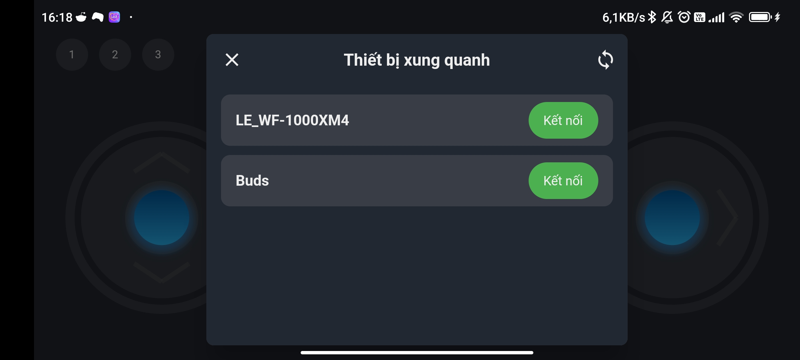

# Joystick Bluetooth

## Joystick Bluetooth - Ứng dụng điều khiển bằng Bluetooth cho ESP32

### Hình ảnh

### Cài đặt

- Ứng dụng được chạy flutter 3.7.0
- Code esp32 mới chỉ để mình test kết nối

### Dữ liệu esp nhận kiểu json

##### Điều khiển joystick trên ứng dụng

    {
        "joystick":{
            "x":0
            "y":0
        }
    }
    Giá trị x,y :  -1 -> 1

##### Nút nhấn trên ứng dụng

    {
        "button":{
            "button1":false,
            "button2":false,
            "button3":false,
            "buttonDefault":false,
        }
    }
